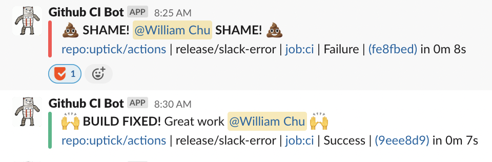

# Github Slack Shaming Action

This github action notifies a slack channel on test failures (and subsequent fixes). The action
will include relevant information as well as slack notifying the user responsible for the failed test.

The command is split into 2 commands. A shame and a praise.
On a `praise` command, the action will search your git history for the last completed JOB
matching the current job. If the last job was a failure, this action will praise the author for fixing it.

The github action is able to locate the slack user by searching your slack organisations api for users with the most similar name and email as the latest git commit.



## Inputs

### `command`

**Required** The command to use. `shame` or `praise` dictates the type of message.

### `SLACK_TOKEN`

**Required** The slack token with permissions to post a chat message and to search users.

### `SLACK_CHANNEL`

**Required** The channel to notify.

### `GITHUB_TOKEN`

**Required** The `GITHUB_TOKEN` with permissions to `read:actions`.

## Example usage

```yaml
permissions:
  actions: read

on: [push]

jobs:
  test:
    runs-on: ubuntu-latest
    steps:
      - name: Checkout Code
        uses: actions/checkout@v3
        with:
          # TODO: Configure fetch-depth?
          fetch-depth: 2

      - name: Test shame works
        if: startsWith(env.BRANCH_NAME, 'main') && failure()
        id: shame
        uses: uptick/actions-shame@main
        with:
          command: "shame"
          SLACK_TOKEN: ${{ secrets.SLACK_TOKEN }}
          SLACK_CHANNEL: "devops-test-slack"
          GITHUB_TOKEN: ${{ secrets.GITHUB_TOKEN }}

      - name: Test praise works
        if: startsWith(env.BRANCH_NAME, 'main') && success()
        id: praise
        uses: uptick/actions-shame@main
        with:
          command: "praise"
          SLACK_TOKEN: ${{ secrets.SLACK_TOKEN }}
          SLACK_CHANNEL: "devops-test-slack"
          GITHUB_TOKEN: ${{ secrets.GITHUB_TOKEN }}
```
